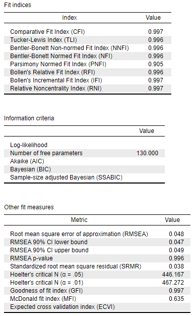
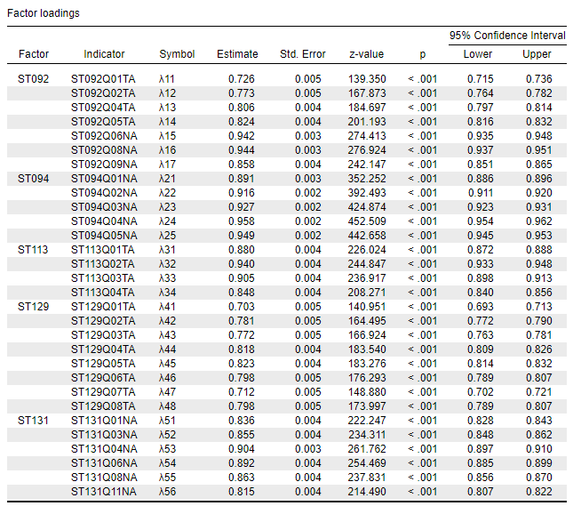
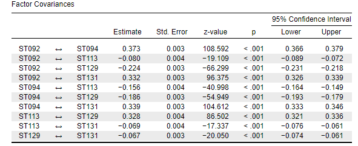
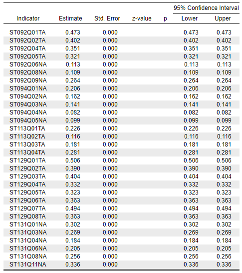
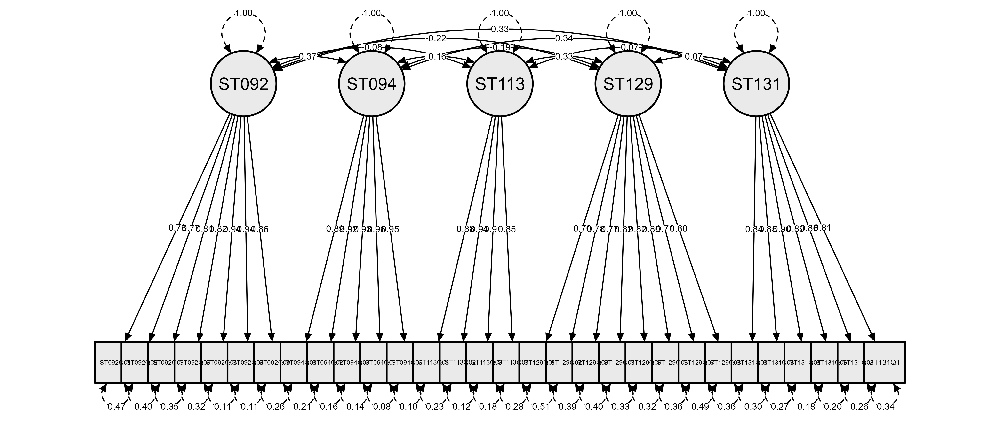

```{r setup, include=FALSE}
knitr::opts_chunk$set(echo = FALSE)
```

Bu çalışmada PISA 2015 ["student questionnaire: paper based verison"](https://www.oecd.org/pisa/data/CY6_QST_MS_STQ_PBA_Final.pdf) içerisindeki en son alt ölçek olan 'Your View on Science' ölçeğinden elde edilen veriler kullanılmıştır. Türkiye örnekleminden faydalanılmıştır. Bu örneklem ile bahsi geçen ölçeğin yapısal eşitlik modelleri oluşturulmuş ve karşılaştırılmıştır. Adım adım veri setinin R ile analize hazır hale getirilmesi anlatılmaktadır. Doğrudan analiz ile ilgileniyorsanız aşağıda **'Analiz Süreci'** başlığına ilerleyiniz.

## Pre-processing süreci

Öncelikle [OECD](https://www.oecd.org/pisa/data/2015database/) tarafından yayınlanan veri setini [şuradan](https://webfs.oecd.org/pisa/PUF_SPSS_COMBINED_CMB_STU_QQQ.zip) indiriyoruz. İndirilen bu dosya .sav uzantılı bbir dosya. Bu tür dosyaları açmak için `haven` paketi `read_sav` fonksiyonundan faydalanabiliriz. Veri setinin tamamına ihtiyacımız yok, zaten oldukça büyük bir veri. Ülke değilşkeni ve ilgili ölçeğin maddeleri yeterli olacaktır. İndirdiğimiz .sav uzantılı dosyayı *working directory'*mize taşıdıktan sonra çalıştıracağımız kod satırı şunlar:

```{r eval=FALSE, echo=TRUE, code_folding=TRUE}
library(haven) 
data <- na.omit(read_sav(
  "CY6_MS_CMB_STU_QQQ.sav",
  col_select = c(
    "CNT",
    "ST092Q01TA",
    "ST092Q02TA",
    "ST092Q04TA",
    "ST092Q05TA",
    "ST092Q06NA",
    "ST092Q08NA",
    "ST092Q09NA",
    
    "ST094Q01NA",
    "ST094Q02NA",
    "ST094Q03NA",
    "ST094Q04NA",
    "ST094Q05NA",
    
    "ST113Q01TA",
    "ST113Q02TA",
    "ST113Q03TA",
    "ST113Q04TA",
    
    "ST129Q01TA",
    "ST129Q02TA",
    "ST129Q03TA",
    "ST129Q04TA",
    "ST129Q05TA",
    "ST129Q06TA",
    "ST129Q07TA",
    "ST129Q08TA",
    
    "ST131Q01NA",
    "ST131Q03NA",
    "ST131Q04NA",
    "ST131Q06NA",
    "ST131Q08NA",
    "ST131Q11NA"
  )
))
```

Ülke değişkenine artık ihtiyacımız yok. O nedenle veri setimizi sadece ölçek maddelerini içerecek şekilde yeniden tanımlayalım:

```{r eval=FALSE, echo=TRUE, code_folding=TRUE}

library(dplyr)
science_data<-filter(data, CNT=="TUR")[,-1]
```

Bu veri setini şu kod satırını yürüterek .csv uzantılı bir dosya olarak bilgisayarıma kaydediyorum. Böylece analiz aşamasında o halini de paylaşabileceğim:

```{r eval=FALSE, echo=TRUE, code_folding=TRUE}
write.csv(science_data, "science_data.csv", row.names = FALSE)
```

## Analiz Süreci

İlgili ölçekten elde edilen veriyi [.csv uzantılı dosya](https://drive.google.com/file/d/1HVNyhK1J6PmwS04_W4B7LCVXEDakFShg/view?usp=sharing) olarak indirebilirsiniz. Bunu read.csv fonksiyonu ile R ortamına aktarabilirsiniz. Veri setimiz hazır. Analizimizde öncelikle doğrulayı faktör analizi kullanacağız. Daha sonra da bi-faktör modelleme yapacağız. Veri setimizi tekrar yükleyelim:

```{r}
science_data<-read.csv("science_data.csv",   header = TRUE, sep = ",")
```

### Doğrulayıcı Faktör Analizi (DFA)

Çalışmamıza konu olan ölçek beş faktörden oluşmaktadır. Bu yapı ile ölçek geliştirme sürecinde tanımlanmıştır. Her faktörde farklı sayılarda maddeler yer almaktadır. Veri setinde bunlar ST ön eki ve faktör numarası ile tanımlanmıştır. Faktörleri ve veri setindeki kodlamalarını şu şekilde listeleyelim:

1.  ST092: How informed are you about the following environmental issues?

2.  ST094: How much do you disagree or agree with the statements about yourself below?

3.  ST113: How much do you agree with the statements below?

4.  ST129: How easy do you think it would be for you to perform the following tasks on your own?

5.  ST131: How much do you disagree or agree with the statements below?

Bu beş faktörün altında tanımlanan yapıya göre DFA uygulayacağız ve bir geçerlilik çalışması yürüteceğiz. Bunun için öncelikle modelimizi R'a tanıtalım:

```{r eval=FALSE, echo=TRUE, code_folding=TRUE}
Science.model <- 'ST092 =~ 1* ST092Q01TA+
                              ST092Q02TA+
                              ST092Q04TA+
                              ST092Q05TA+
                              ST092Q06NA+
                              ST092Q08NA+
                              ST092Q09NA
                              
                  ST094 =~ 1* ST094Q01NA+
                              ST094Q02NA+
                              ST094Q03NA+
                              ST094Q04NA+
                              ST094Q05NA
                              
                  ST113 =~ 1* ST113Q01TA+
                              ST113Q02TA+
                              ST113Q03TA+
                              ST113Q04TA
                  
                  ST129 =~ 1* ST129Q01TA+
                              ST129Q02TA+
                              ST129Q03TA+
                              ST129Q04TA+
                              ST129Q05TA+
                              ST129Q06TA+
                              ST129Q07TA+
                              ST129Q08TA
                              
                  ST131 =~ 1* ST131Q01NA+
                              ST131Q03NA+
                              ST131Q04NA+
                              ST131Q06NA+
                              ST131Q08NA+
                              ST131Q11NA            
                    
                           
                            ST092 ~~ ST094
                            ST092 ~~ ST113
                            ST092 ~~ ST129
                            ST092 ~~ ST131
                            
                            ST094 ~~ ST113
                            ST094 ~~ ST129
                            ST094 ~~ ST131
                            
                            ST113 ~~ ST129
                            ST113 ~~ ST131
                            
                            ST129 ~~ ST131'
```

Şimdi Türkiye örnekleminden elde edilen verimizin bu modele uyum sağlayıp sağlamadığına bakacağız. Bu aşamada çeşitli modelleme yaklaşımlarından çıktılar alarak bunları karşılaştıracağız. Bu modelleme yaklaşımları şunlardır:

-   *maximum likelihood model (MLM)*

-   *weighted least squares (WLS)*

-   *robust maximum likelihood model (RMLM)*

-   *diagonally weighted least squares (DWLS)*

Yukarıdaki lsitede görüldüğü sıra ile modellerimizi `lavaan` paketiyle oluşturalım:

```{r eval=FALSE, echo=TRUE, code_folding=TRUE}
library(lavaan)
model_mlm <- cfa(Science.model, data = science_data)
model_wls <- cfa(Science.model, WLS.V = TRUE, data = science_data)
model_rml <- cfa(Science.model, estimator = "MLM", se = "robust.mlm", data = science_data)
model_dwls<-cfa(Science.model, data = science_data, estimator="DWLS")
```

Her biri için de ayrı ayrı analiz çıktılarını `summary()` fonksiyonu ile tanımlayalım:

```{r eval=FALSE, echo=TRUE, code_folding=TRUE}

science.mlm<-summary(
  model_mlm,
  fit.measures = TRUE,
  standardized = TRUE,
  rsquare = TRUE,
  modindices = TRUE
)
science.wls<-summary(
  model_wls,
  fit.measures = TRUE,
  standardized = TRUE,
  rsquare = TRUE,
  modindices = TRUE
)
science.rml<-summary(
  model_rml,
  fit.measures = TRUE,
  standardized = TRUE,
  rsquare = TRUE,
  modindices = TRUE
)
science.dwls<-summary(
  model_dwls,
  fit.measures = TRUE,
  standardized = TRUE,
  rsquare = TRUE,
  modindices = TRUE
)
```

Tabi ki hem literatürde en yaygın kullanılan hem de alan uzmanları tarafından en ok önerilen yöntem olması sebebiyle MLM yöntemi önceliğimiz. Bu yöntemde normallik varsayımı karşılandığı sürece güçlü analizler elde edilebilmektedir. Veri setimiz de büyük bir örneklemden elde edildiği için bu varsayımın karşılandığı düşünülmektedir. Grafik incelemelerinde de bu durum görülecektir. Dolayısıyla öncelikle MLM'ye ait uyum indekslerini görelim:

```{r eval=FALSE, echo=TRUE, code_folding=TRUE}
science.mlm[["fit"]]
```

```{r echo=FALSE, code_folding=FALSE}
library(lavaan)
Science.model <- 'ST092 =~ 1* ST092Q01TA+
                              ST092Q02TA+
                              ST092Q04TA+
                              ST092Q05TA+
                              ST092Q06NA+
                              ST092Q08NA+
                              ST092Q09NA
                              
                  ST094 =~ 1* ST094Q01NA+
                              ST094Q02NA+
                              ST094Q03NA+
                              ST094Q04NA+
                              ST094Q05NA
                              
                  ST113 =~ 1* ST113Q01TA+
                              ST113Q02TA+
                              ST113Q03TA+
                              ST113Q04TA
                  
                  ST129 =~ 1* ST129Q01TA+
                              ST129Q02TA+
                              ST129Q03TA+
                              ST129Q04TA+
                              ST129Q05TA+
                              ST129Q06TA+
                              ST129Q07TA+
                              ST129Q08TA
                              
                  ST131 =~ 1* ST131Q01NA+
                              ST131Q03NA+
                              ST131Q04NA+
                              ST131Q06NA+
                              ST131Q08NA+
                              ST131Q11NA            
                    
                           
                            ST092 ~~ ST094
                            ST092 ~~ ST113
                            ST092 ~~ ST129
                            ST092 ~~ ST131
                            
                            ST094 ~~ ST113
                            ST094 ~~ ST129
                            ST094 ~~ ST131
                            
                            ST113 ~~ ST129
                            ST113 ~~ ST131
                            
                            ST129 ~~ ST131'
model_mlm <- cfa(Science.model, data = science_data)
science.mlm<-summary(
  model_mlm,
  fit.measures = TRUE,
  standardized = TRUE,
  rsquare = TRUE,
  modindices = TRUE
)
science.mlm[["fit"]]
```

Bu çıktılar incelendiğinde, 70 parametreli 395 serbestlik derecesinde bir model oluştuğu görülmektedir. CFI ve TLI uyum indekleri .90 eşik değerin üzerindeyken, RMSEA ve SRMR .06'nın altında yer almaktadır. Bu durumda modelimizin uyumlu olduğu düşünülebilir. Yine de diğer modeller ile de karşılaştırmak gerekir. Onların uyum indeklerini de görelim:

**WLS model:**

```{r eval=FALSE, echo=TRUE, code_folding=TRUE}
science.wls[["fit"]]
```

```{r echo=FALSE, code_folding=FALSE}
library(lavaan)
Science.model <- 'ST092 =~ 1* ST092Q01TA+
                              ST092Q02TA+
                              ST092Q04TA+
                              ST092Q05TA+
                              ST092Q06NA+
                              ST092Q08NA+
                              ST092Q09NA
                              
                  ST094 =~ 1* ST094Q01NA+
                              ST094Q02NA+
                              ST094Q03NA+
                              ST094Q04NA+
                              ST094Q05NA
                              
                  ST113 =~ 1* ST113Q01TA+
                              ST113Q02TA+
                              ST113Q03TA+
                              ST113Q04TA
                  
                  ST129 =~ 1* ST129Q01TA+
                              ST129Q02TA+
                              ST129Q03TA+
                              ST129Q04TA+
                              ST129Q05TA+
                              ST129Q06TA+
                              ST129Q07TA+
                              ST129Q08TA
                              
                  ST131 =~ 1* ST131Q01NA+
                              ST131Q03NA+
                              ST131Q04NA+
                              ST131Q06NA+
                              ST131Q08NA+
                              ST131Q11NA            
                    
                           
                            ST092 ~~ ST094
                            ST092 ~~ ST113
                            ST092 ~~ ST129
                            ST092 ~~ ST131
                            
                            ST094 ~~ ST113
                            ST094 ~~ ST129
                            ST094 ~~ ST131
                            
                            ST113 ~~ ST129
                            ST113 ~~ ST131
                            
                            ST129 ~~ ST131'


model_wls <- cfa(Science.model, WLS.V = TRUE, data = science_data)

science.wls<-summary(
  model_wls,
  fit.measures = TRUE,
  standardized = TRUE,
  rsquare = TRUE,
  modindices = TRUE
)
science.wls[["fit"]]
```

**RML model:**

```{r eval=FALSE, echo=TRUE, code_folding=TRUE}
science.rml[["fit"]]
```

```{r echo=FALSE, code_folding=FALSE}
library(lavaan)
Science.model <- 'ST092 =~ 1* ST092Q01TA+
                              ST092Q02TA+
                              ST092Q04TA+
                              ST092Q05TA+
                              ST092Q06NA+
                              ST092Q08NA+
                              ST092Q09NA
                              
                  ST094 =~ 1* ST094Q01NA+
                              ST094Q02NA+
                              ST094Q03NA+
                              ST094Q04NA+
                              ST094Q05NA
                              
                  ST113 =~ 1* ST113Q01TA+
                              ST113Q02TA+
                              ST113Q03TA+
                              ST113Q04TA
                  
                  ST129 =~ 1* ST129Q01TA+
                              ST129Q02TA+
                              ST129Q03TA+
                              ST129Q04TA+
                              ST129Q05TA+
                              ST129Q06TA+
                              ST129Q07TA+
                              ST129Q08TA
                              
                  ST131 =~ 1* ST131Q01NA+
                              ST131Q03NA+
                              ST131Q04NA+
                              ST131Q06NA+
                              ST131Q08NA+
                              ST131Q11NA            
                    
                           
                            ST092 ~~ ST094
                            ST092 ~~ ST113
                            ST092 ~~ ST129
                            ST092 ~~ ST131
                            
                            ST094 ~~ ST113
                            ST094 ~~ ST129
                            ST094 ~~ ST131
                            
                            ST113 ~~ ST129
                            ST113 ~~ ST131
                            
                            ST129 ~~ ST131'
model_rml <- cfa(Science.model, estimator = "MLM", se = "robust.mlm", data = science_data)
science.rml<-summary(
  model_rml,
  fit.measures = TRUE,
  standardized = TRUE,
  rsquare = TRUE,
  modindices = TRUE
)
science.rml[["fit"]]
```

**DWLS model:**

```{r eval=FALSE, echo=TRUE, code_folding=TRUE}
science.dwls[["fit"]]
```

```{r echo=FALSE, code_folding=FALSE}
library(lavaan)
Science.model <- 'ST092 =~ 1* ST092Q01TA+
                              ST092Q02TA+
                              ST092Q04TA+
                              ST092Q05TA+
                              ST092Q06NA+
                              ST092Q08NA+
                              ST092Q09NA
                              
                  ST094 =~ 1* ST094Q01NA+
                              ST094Q02NA+
                              ST094Q03NA+
                              ST094Q04NA+
                              ST094Q05NA
                              
                  ST113 =~ 1* ST113Q01TA+
                              ST113Q02TA+
                              ST113Q03TA+
                              ST113Q04TA
                  
                  ST129 =~ 1* ST129Q01TA+
                              ST129Q02TA+
                              ST129Q03TA+
                              ST129Q04TA+
                              ST129Q05TA+
                              ST129Q06TA+
                              ST129Q07TA+
                              ST129Q08TA
                              
                  ST131 =~ 1* ST131Q01NA+
                              ST131Q03NA+
                              ST131Q04NA+
                              ST131Q06NA+
                              ST131Q08NA+
                              ST131Q11NA            
                    
                           
                            ST092 ~~ ST094
                            ST092 ~~ ST113
                            ST092 ~~ ST129
                            ST092 ~~ ST131
                            
                            ST094 ~~ ST113
                            ST094 ~~ ST129
                            ST094 ~~ ST131
                            
                            ST113 ~~ ST129
                            ST113 ~~ ST131
                            
                            ST129 ~~ ST131'
model_dwls<-cfa(Science.model, data = science_data, estimator="DWLS")
science.dwls<-summary(
  model_dwls,
  fit.measures = TRUE,
  standardized = TRUE,
  rsquare = TRUE,
  modindices = TRUE
)
science.dwls[["fit"]]
```

Tüm bu çıktılar incelendiğinde, en uygun modelin *diagonally weighted least squares (DWLS)* olduğu düşünülmektedir. Veri setinin farklı ölçek düzeyinde olması ve kategorik olması bu durumun sebebi olabilir. DWLS modeli, liteatürde yaygın bir şekilde bu tür veri setleri için önerilmektedir.

### BI-FACTOR MODELLER

Bi faktör modellemede yapıyı oluşturan faktörlerin tüm maddelerden oluşan genel faktör ile ilişkisi incelenerek karar verilir. Bu amaçla DFA örneğinde olduğu gibi model tanımlamamızı yapıyoruz:

```{r eval=FALSE, echo=TRUE, code_folding=TRUE}
Science.bifactormodel <- 'general.factor =~
                              ST092Q01TA+
                              ST092Q02TA+
                              ST092Q04TA+
                              ST092Q05TA+
                              ST092Q06NA+
                              ST092Q08NA+
                              ST092Q09NA+
                              ST094Q01NA+
                              ST094Q02NA+
                              ST094Q03NA+
                              ST094Q04NA+
                              ST094Q05NA+
                              ST113Q01TA+
                              ST113Q02TA+
                              ST113Q03TA+
                              ST113Q04TA+
                              ST129Q01TA+
                              ST129Q02TA+
                              ST129Q03TA+
                              ST129Q04TA+
                              ST129Q05TA+
                              ST129Q06TA+
                              ST129Q07TA+
                              ST129Q08TA+
                              ST131Q01NA+
                              ST131Q03NA+
                              ST131Q04NA+
                              ST131Q06NA+
                              ST131Q08NA+
                              ST131Q11NA

                  ST092 =~ 1* ST092Q01TA+
                              ST092Q02TA+
                              ST092Q04TA+
                              ST092Q05TA+
                              ST092Q06NA+
                              ST092Q08NA+
                              ST092Q09NA

                  ST094 =~ 1* ST094Q01NA+
                              ST094Q02NA+
                              ST094Q03NA+
                              ST094Q04NA+
                              ST094Q05NA

                  ST113 =~ 1* ST113Q01TA+
                              ST113Q02TA+
                              ST113Q03TA+
                              ST113Q04TA

                  ST129 =~ 1* ST129Q01TA+
                              ST129Q02TA+
                              ST129Q03TA+
                              ST129Q04TA+
                              ST129Q05TA+
                              ST129Q06TA+
                              ST129Q07TA+
                              ST129Q08TA

                  ST131 =~ 1* ST131Q01NA+
                              ST131Q03NA+
                              ST131Q04NA+
                              ST131Q06NA+
                              ST131Q08NA+
                              ST131Q11NA
                              

                general.factor  ~~ 0*ST092
                general.factor  ~~ 0*ST094
                general.factor  ~~ 0*ST113
                general.factor  ~~ 0*ST129
                general.factor  ~~ 0*ST131
                
                            ST092 ~~ ST094
                            ST092 ~~ ST113
                            ST092 ~~ ST129
                            ST092 ~~ ST131

                            ST094 ~~ ST113
                            ST094 ~~ ST129
                            ST094 ~~ ST131

                            ST113 ~~ ST129
                            ST113 ~~ ST131

                            ST129 ~~ ST131'

```

Ardından modellerimizi veri setimiz ile sınıyoruz.

```{r eval=FALSE, echo=TRUE, code_folding=TRUE}
Science.bifactormodel_mlm <-
  cfa(
    Science.bifactormodel,
    data = science_data,
    std.lv = TRUE,
    information = "observed"
  )
Science.bifactormodel_rml <-
  cfa(
    Science.bifactormodel,
    data = science_data,
    estimator = "MLM",
    se = "robust.mlm",
    std.lv = TRUE,
    information = "observed"
  )
bifactor_mlm <- summary(Science.bifactormodel_mlm ,
        fit.measures = TRUE,
        standardized = TRUE)
bifactor_rml <- summary(Science.bifactormodel_rml ,
        fit.measures = TRUE,
        standardized = TRUE)

bifactor_mlm[['fit']]
bifactor_rml[['fit']]
```

**BI-FAKTÖR ML model:**

```{r echo=FALSE, code_folding=FALSE}
library(lavaan)
Science.bifactormodel <- 'general.factor =~
                              ST092Q01TA+
                              ST092Q02TA+
                              ST092Q04TA+
                              ST092Q05TA+
                              ST092Q06NA+
                              ST092Q08NA+
                              ST092Q09NA+
                              ST094Q01NA+
                              ST094Q02NA+
                              ST094Q03NA+
                              ST094Q04NA+
                              ST094Q05NA+
                              ST113Q01TA+
                              ST113Q02TA+
                              ST113Q03TA+
                              ST113Q04TA+
                              ST129Q01TA+
                              ST129Q02TA+
                              ST129Q03TA+
                              ST129Q04TA+
                              ST129Q05TA+
                              ST129Q06TA+
                              ST129Q07TA+
                              ST129Q08TA+
                              ST131Q01NA+
                              ST131Q03NA+
                              ST131Q04NA+
                              ST131Q06NA+
                              ST131Q08NA+
                              ST131Q11NA

                  ST092 =~ 1* ST092Q01TA+
                              ST092Q02TA+
                              ST092Q04TA+
                              ST092Q05TA+
                              ST092Q06NA+
                              ST092Q08NA+
                              ST092Q09NA

                  ST094 =~ 1* ST094Q01NA+
                              ST094Q02NA+
                              ST094Q03NA+
                              ST094Q04NA+
                              ST094Q05NA

                  ST113 =~ 1* ST113Q01TA+
                              ST113Q02TA+
                              ST113Q03TA+
                              ST113Q04TA

                  ST129 =~ 1* ST129Q01TA+
                              ST129Q02TA+
                              ST129Q03TA+
                              ST129Q04TA+
                              ST129Q05TA+
                              ST129Q06TA+
                              ST129Q07TA+
                              ST129Q08TA

                  ST131 =~ 1* ST131Q01NA+
                              ST131Q03NA+
                              ST131Q04NA+
                              ST131Q06NA+
                              ST131Q08NA+
                              ST131Q11NA
                              

                general.factor  ~~ 0*ST092
                general.factor  ~~ 0*ST094
                general.factor  ~~ 0*ST113
                general.factor  ~~ 0*ST129
                general.factor  ~~ 0*ST131
                
                            ST092 ~~ ST094
                            ST092 ~~ ST113
                            ST092 ~~ ST129
                            ST092 ~~ ST131

                            ST094 ~~ ST113
                            ST094 ~~ ST129
                            ST094 ~~ ST131

                            ST113 ~~ ST129
                            ST113 ~~ ST131

                            ST129 ~~ ST131'
Science.bifactormodel_mlm <-
  cfa(
    Science.bifactormodel,
    data = science_data,
    std.lv = TRUE,
    information = "observed"
  )
Science.bifactormodel_rml <-
  cfa(
    Science.bifactormodel,
    data = science_data,
    estimator = "MLM",
    se = "robust.mlm",
    std.lv = TRUE,
    information = "observed"
  )
bifactor_mlm <- summary(Science.bifactormodel_mlm ,
        fit.measures = TRUE,
        standardized = TRUE)
bifactor_rml <- summary(Science.bifactormodel_rml ,
        fit.measures = TRUE,
        standardized = TRUE)

bifactor_mlm[['fit']]

```

**BI-FAKTÖR ROBUST ML model:**

```{r echo=FALSE, code_folding=FALSE}
library(lavaan)
Science.bifactormodel <- 'general.factor =~
                              ST092Q01TA+
                              ST092Q02TA+
                              ST092Q04TA+
                              ST092Q05TA+
                              ST092Q06NA+
                              ST092Q08NA+
                              ST092Q09NA+
                              ST094Q01NA+
                              ST094Q02NA+
                              ST094Q03NA+
                              ST094Q04NA+
                              ST094Q05NA+
                              ST113Q01TA+
                              ST113Q02TA+
                              ST113Q03TA+
                              ST113Q04TA+
                              ST129Q01TA+
                              ST129Q02TA+
                              ST129Q03TA+
                              ST129Q04TA+
                              ST129Q05TA+
                              ST129Q06TA+
                              ST129Q07TA+
                              ST129Q08TA+
                              ST131Q01NA+
                              ST131Q03NA+
                              ST131Q04NA+
                              ST131Q06NA+
                              ST131Q08NA+
                              ST131Q11NA

                  ST092 =~ 1* ST092Q01TA+
                              ST092Q02TA+
                              ST092Q04TA+
                              ST092Q05TA+
                              ST092Q06NA+
                              ST092Q08NA+
                              ST092Q09NA

                  ST094 =~ 1* ST094Q01NA+
                              ST094Q02NA+
                              ST094Q03NA+
                              ST094Q04NA+
                              ST094Q05NA

                  ST113 =~ 1* ST113Q01TA+
                              ST113Q02TA+
                              ST113Q03TA+
                              ST113Q04TA

                  ST129 =~ 1* ST129Q01TA+
                              ST129Q02TA+
                              ST129Q03TA+
                              ST129Q04TA+
                              ST129Q05TA+
                              ST129Q06TA+
                              ST129Q07TA+
                              ST129Q08TA

                  ST131 =~ 1* ST131Q01NA+
                              ST131Q03NA+
                              ST131Q04NA+
                              ST131Q06NA+
                              ST131Q08NA+
                              ST131Q11NA
                              

                general.factor  ~~ 0*ST092
                general.factor  ~~ 0*ST094
                general.factor  ~~ 0*ST113
                general.factor  ~~ 0*ST129
                general.factor  ~~ 0*ST131
                
                            ST092 ~~ ST094
                            ST092 ~~ ST113
                            ST092 ~~ ST129
                            ST092 ~~ ST131

                            ST094 ~~ ST113
                            ST094 ~~ ST129
                            ST094 ~~ ST131

                            ST113 ~~ ST129
                            ST113 ~~ ST131

                            ST129 ~~ ST131'
Science.bifactormodel_mlm <-
  cfa(
    Science.bifactormodel,
    data = science_data,
    std.lv = TRUE,
    information = "observed"
  )
Science.bifactormodel_rml <-
  cfa(
    Science.bifactormodel,
    data = science_data,
    estimator = "MLM",
    se = "robust.mlm",
    std.lv = TRUE,
    information = "observed"
  )
bifactor_mlm <- summary(Science.bifactormodel_mlm ,
        fit.measures = TRUE,
        standardized = TRUE)
bifactor_rml <- summary(Science.bifactormodel_rml ,
        fit.measures = TRUE,
        standardized = TRUE)

bifactor_rml[['fit']]
```

Bu çıktılar incelendiğinde de bi faktör modelin verimize DWLS model kadar uyumlu olmadığı görülmektedir. Bu nedenle DWLS modelin en uyumlu model olduğu düşünülmektedir. Bu modelin çıktılarını tablolaştıralım.

### EN UYUMLU MODEL:DWLS çıktıları

NOT: Faktör varyansları sabitlenerek model oluşturulduğu için faktör varyansları tablosu raporlaştırılmamıştır.

#### Model uyum indeksleri


Parametre Tahminleri



#### Faktör Kovaryansları



#### Artık (residual) Varyanslar



#### Model gösterimi

	

